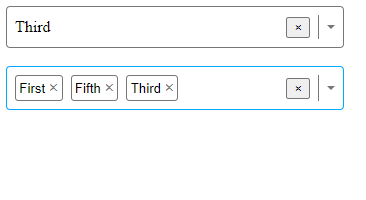

# React Single and Multi Select Component

This is a [tutorial](https://www.youtube.com/watch?v=bAJlYgeovlg&list=PL4EX4Aw5_AFv-9yS-9lF3SNHUImZyygK7&index=3) project from [Web Dev Simplified](https://www.youtube.com/@WebDevSimplified) on YouTube. 

## The challenge

Users should be able to:

- Select a value from the first dropdown menu
- Remove the selected value from the first dropdown menu
- Select multiple values from the second dropdown menu
- Remove the selected values one by one or all at once from the second dropdown menu
- Perform the same operations using their keyboard

### Screenshot

## Links

- [View Code](https://github.com/elizerdim/react-single-and-multi-select)
- [Live Preview](https://react-single-and-multi-select.vercel.app/)

## Built with

- React
- TypeScript

## What I learned

This was a great project for me to practice React in general, especially useState and useEffect, and learn how to implement keyboard functionality to custom elements. I will definetely refer back to this project when implementing similar elements in other projects.